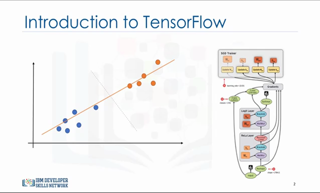
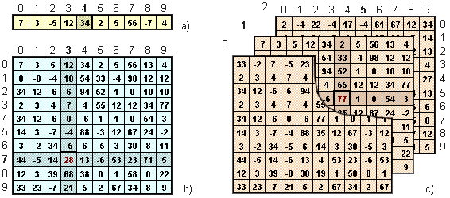
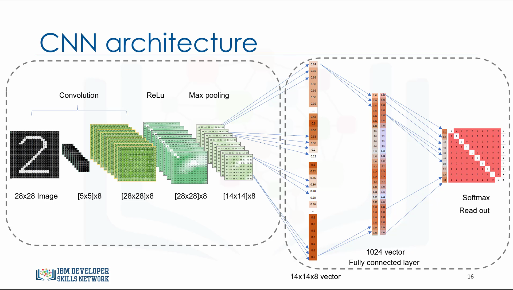
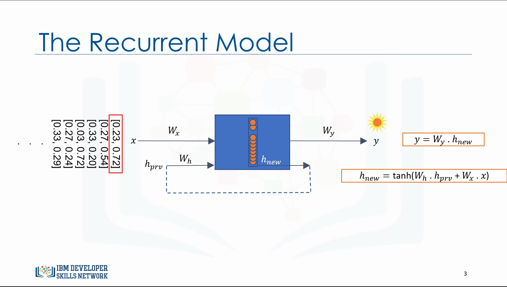
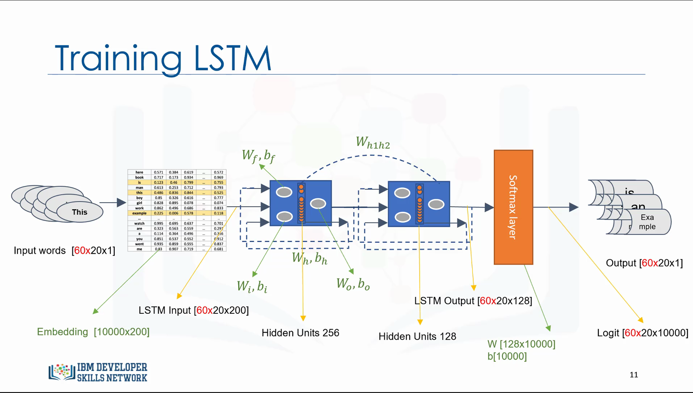
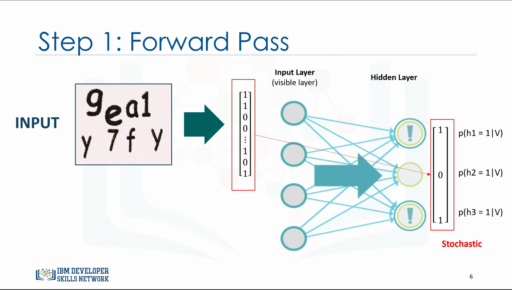
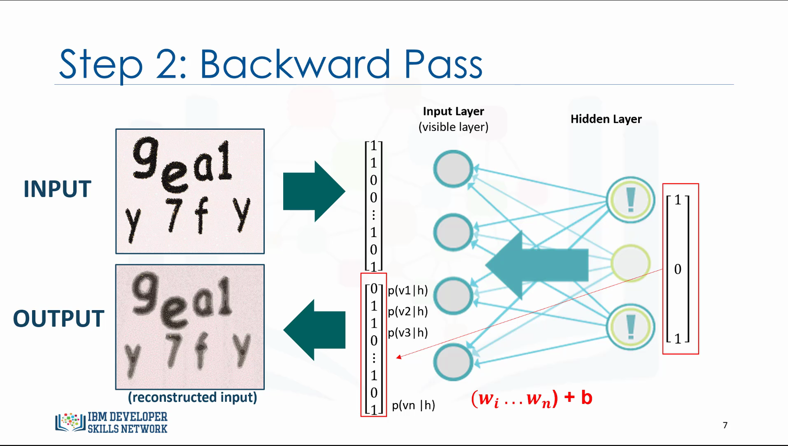
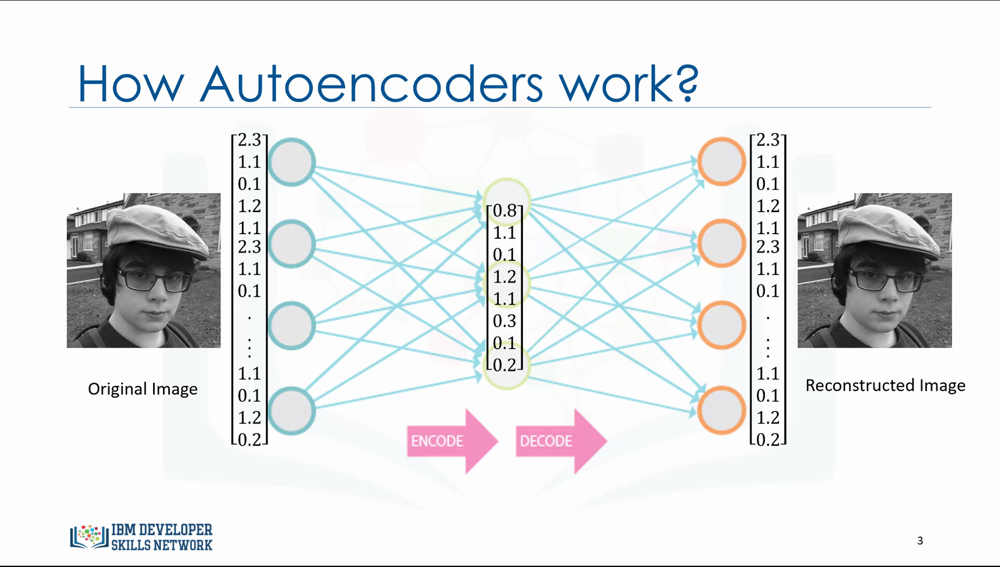
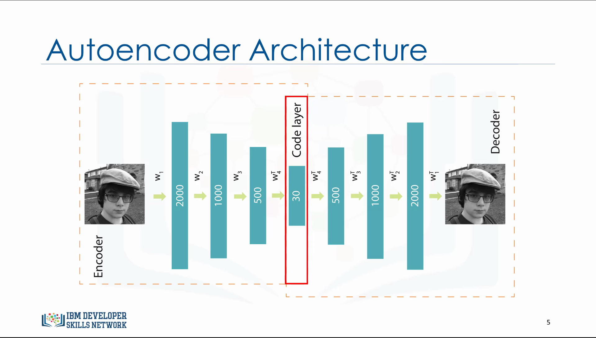
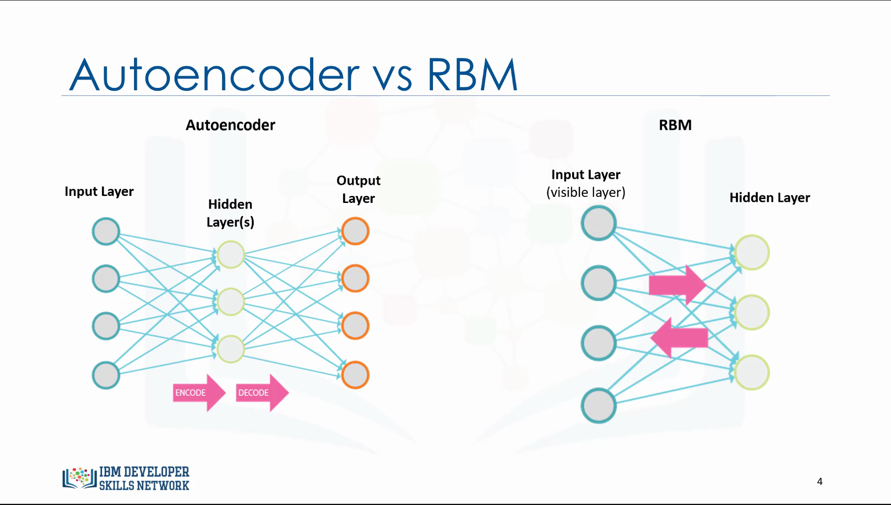

## Quick Start

The workshop code is available as [Jupyter notebooks](https://github.com/aymanibrahim/dltf/tree/master/notebooks). You can run the notebooks in the cloud (no installation required) by clicking the "launch binder" button:

[](https://mybinder.org/v2/gh/aymanibrahim/dltf/master)

# Why
For people who struggle to start in deep learning with TensorFlow

# Description


This hands-on in-person workshop is based on [Deep Learning with TensorFlow Course by IBM Cognitive Class](https://cognitiveclass.ai/courses/deep-learning-TensorFlow)

>Learn how to get started with TensorFlow to capture relevant structure in images, sound, and textual data from unlabeled and unstructured data.

# [Outline](https://github.com/aymanibrahim/dltf/blob/master/notebooks/00_Outline.ipynb)
The workshop will cover core topics:

## [01 Intro](https://github.com/aymanibrahim/dltf/blob/master/notebooks/01_Intro.ipynb) [](https://colab.research.google.com/github/aymanibrahim/dltf/blob/master/notebooks/01_Intro.ipynb)


Data Graph           |  Tensors | ReLu
:-------------------------:|:-------------------------:|:-------------------------:
  |  |  

- HelloWorld with TensorFlow
- Linear and Logistic Regression with TensorFlow
- Activation Functions

## [02 Convolutional Neural Networks (CNN)](https://github.com/aymanibrahim/dltf/blob/master/notebooks/02_CNN.ipynb) [](https://colab.research.google.com/github/aymanibrahim/dltf/blob/master/notebooks/02_CNN.ipynb)

Convolution           |  Training |  Architecture
:-------------------------:|:-------------------------:|:-------------------------:
  |  |  

- Introduction to Convolutional Networks
- Convolution and Feature Learning
- Convolution with Python and TensorFlow
- MNIST Dataset
- Multilayer Perceptron with TensorFlow
- Convolutional Network with TensorFlow

## [03 Recurrent Neural Networks (RNN)](https://github.com/aymanibrahim/dltf/blob/master/notebooks/03_RNN.ipynb) [](https://colab.research.google.com/github/aymanibrahim/dltf/blob/master/notebooks/03_RNN.ipynb)


Sequentaial Data           |  Recurrent Model |  LSTM
:-------------------------:|:-------------------------:|:-------------------------:
  |  |  

- Recurrent Neural Network Model 
- Long Short-Term Memory
- Recursive Neural Tensor Network Theory
- Applying Recurrent Networks to Language Modelling

## [04 Unsupervised Learning](https://github.com/aymanibrahim/dltf/blob/master/notebooks/04_RBM.ipynb) [](https://colab.research.google.com/github/aymanibrahim/dltf/blob/master/notebooks/04_RBM.ipynb)


Forward Pass           |  Backward Pass |  Quality Assessment
:-------------------------:|:-------------------------:|:-------------------------:
  |  |  

- Applications of Unsupervised Learning
- Restricted Boltzmann Machine
- Training a Restricted Boltzman Machine
- Recommendation System with a Restrictive Boltzman Machine

## [05 Autoencoders](https://github.com/aymanibrahim/dltf/blob/master/notebooks/05_Autoencoders.ipynb) [](https://colab.research.google.com/github/aymanibrahim/dltf/blob/master/notebooks/05_Autoencoders.ipynb)

Encode/Decode           |  Architecture |  Autoencoder vs RBM
:-------------------------:|:-------------------------:|:-------------------------:
  |  |  

- Introduction to Autoencoders and Applications
- Autoencoder Structure
- Deep Belief Network

# Prerequisites
- [Python for Data Science Workshop](https://github.com/aymanibrahim/pyds)
- [Data Analysis with Python Workshop](https://github.com/aymanibrahim/dapy)
- [Machine Learning with Python Workshop](https://github.com/aymanibrahim/mlpy)

# Pre-workshop 

You will need a laptop that can access the internet 

## 1: Installation
Install miniconda or install the (larger) Anaconda distribution

[Install Python 3.7 using Miniconda](https://conda.io/projects/conda/en/latest/user-guide/install/index.html)

OR [Install Python 3.7 using Ananconda](https://www.anaconda.com/distribution/)

## 2: Setup

### 2.1: Download workshop code & materials
Clone the repository
```
git clone git@github.com:aymanibrahim/dltf.git
```
OR [Download the repository as a .zip file](https://github.com/aymanibrahim/dltf/archive/master.zip)

### 2.2: Change directory to pyds
Change current directory to **dltf** directory
```
cd dltf
```
### 2.3: Install Python with required packages
Install Python 3.7 with the required packages into an environment named _dltf_  as per [environment.yml](https://github.com/aymanibrahim/dltf/blob/master/environment.yml) YAML file.
```
conda env create -f environment.yml
```
When conda asks if you want to proceed, type "y" and press Enter.

## 3: Activate environment
Change the current default environment (_base_) into _dltf_ environment.
```
conda activate dltf
```

## 4: Install & Enable ipywidgets extentions
Install ipywidgets JupyterLab extension
```
jupyter labextension install @jupyter-widgets/jupyterlab-manager
```

Enable  widgetsnbextension
```
jupyter nbextension enable --py widgetsnbextension --sys-prefix
```


## 5: Check installation
Use [check_environment.py](https://github.com/aymanibrahim/dltf/blob/master/check_environment.py) script to make sure everything was installed correctly, open a terminal, and change its directory (cd) so that your working directory is the workshop directory _dltf_ you cloned or downloaded. Then enter the following:
```
python check_environment.py
```
If everything is OK, you will get the following message:
> Your workshop environment is set up

## 6: Start JupyterLab
Start JupyterLab using:
```
jupyter lab
```
JupyterLab will open automatically in your browser.

You may access JupyterLab by entering the notebook server’s URL into the browser.

## 7: Stop JupyterLab
Press **CTRL + C** in the terminal to stop JupyterLab.

## 8: Deactivate environment
Change the current environment (_dltf_) into the previous environment.
```
conda deactivate
```

# Workshop Instructor
## Ayman Ibrahim, PMP

- [LinkedIn](https://www.linkedin.com/in/aymanibrahim/)
- [Kaggle](https://www.kaggle.com/aymani)
- [GitHub](https://github.com/aymanibrahim)
- [Twitter](https://twitter.com/AymanIbrahim)
- [Facebook](https://www.facebook.com/ayman.ibrahim.awad)

# References
- [Python: Programming language](https://www.python.org)
- [Conda: Package and environment manager](https://conda.io/en/latest/)
- [Anaconda: Python distribution](https://www.anaconda.com/distribution/)
- [Miniconda: Minimal installer for conda](https://conda.io/en/latest/miniconda.html)
- [NumPy: Fundamental package for scientific computing with Python](https://numpy.org)
- [Matplotlib: Python 2D plotting library](https://matplotlib.org)
- [seaborn: Statistical Data Visualization](https://seaborn.pydata.org)
- [pandas: Python data analysis library](https://pandas.pydata.org)
- [scikit-learn: Machine Learning in Python](https://scikit-learn.org/stable/index.html)
- [TensorFlow: Deep Learning in Python](https://www.TensorFlow.org/)
- [Jupyter Notebook: Web application to create documents with code, equations, visualizations and text](https://jupyter.org/)
- [JupyterLab: Web-based development environment for Jupyter Notebooks](https://jupyter.org/)
- [Python for Data Science: Course by IBM Cognitive Class](https://cognitiveclass.ai/courses/python-for-data-science/)
- [Data Analysis with Python: Course by IBM Cognitive Class](https://cognitiveclass.ai/courses/data-analysis-python/)
- [Data Visualization with Python: Course by IBM Cognitive Class](https://cognitiveclass.ai/courses/data-visualization-with-python/)
- [Machine Learning with Python: Course by IBM Cognitive Class](https://cognitiveclass.ai/courses/machine-learning-with-python/)
- [Deep Learning with TensorFlow Course by IBM Cognitive Class](https://cognitiveclass.ai/courses/deep-learning-TensorFlow)

# Contributing
Thanks for your interest in contributing! There are many ways to contribute to this project. Get started [here](https://github.com/aymanibrahim/dltf/blob/master/CONTRIBUTING.md).

# License

## Workshop Code
[](https://opensource.org/licenses/MIT)

## Workshop Materials

<a rel="license" href="http://creativecommons.org/licenses/by/4.0/"></a>

<span xmlns:dct="http://purl.org/dc/terms/" property="dct:title">*Machine Learning with Python Workshop*</span> by <a xmlns:cc="http://creativecommons.org/ns#" href="https://github.com/aymanibrahim" property="cc:attributionName" rel="cc:attributionURL">Ayman Ibrahim</a> is licensed under a <a rel="license" href="http://creativecommons.org/licenses/by/4.0/">Creative Commons Attribution 4.0 International License</a>.  Based on a work at <a xmlns:dct="http://purl.org/dc/terms/" href="https://cognitiveclass.ai/courses/deep-learning-TensorFlow/" rel="dct:source">IBM Cognitive Class Deep Learning with TensorFlow Course </a> by <a href="https://www.linkedin.com/in/saeedaghabozorgi/"> Saeed Aghabozorgi, PhD </a>, <a href="https://www.linkedin.com/in/rafaelblsilvai/"> Rafael Belo da Silva</a>, <a href="https://www.linkedin.com/in/erich-natsubori-sato"> Erich Natsubori Sato </a> and <a href="https://www.linkedin.com/in/walter-gomes/"> Walter Gomes de Amorim Junior</a>.
